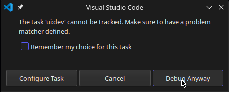

# NOTES

## Start

```shell
$ pnpm i
$ pnpm build
$ pnpm tauri
```

## Debug Rust

1. add breakpoint to `format!("Hello, {}!", name)`
2. add breakpoint to `greetMsg = await invoke('greet', { name });`
3. launch `Tauri Development Debug` this will launch tauri app in debug mode



proceed in dialog

4. click button in **tauri window** and it breaks on breakpoint

## Debug Frontend

if not launch `Tauri Development Debug`, that is optionally, launch `pnpm tauri:dev` first

1. add breakpoint to `greetMsg = await invoke('greet', { name });`
2. launch `Lauch Tauri in Browser` this will launch sveltekit app in debug mode, in a new debug browser window
3. click button in **debug browser window** and it breaks on breakpoint

## Disable text selection

- [How do I disable text selection with CSS or JavaScript?](https://stackoverflow.com/questions/3779534/how-do-i-disable-text-selection-with-css-or-javascript)

check `src/routes/+layout.svelte` or `src/app.css`
